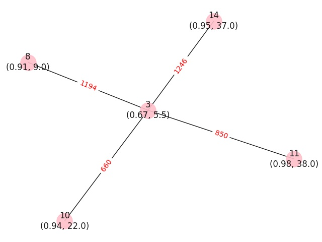
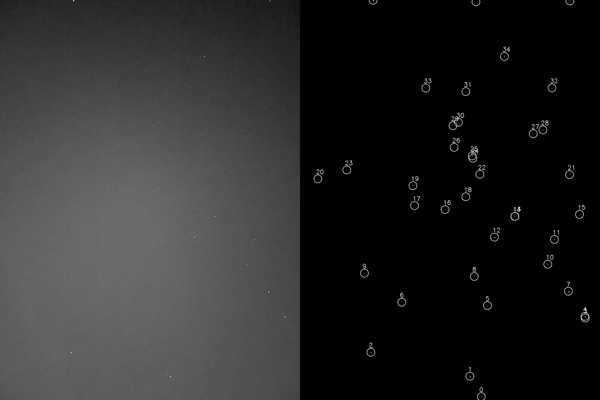
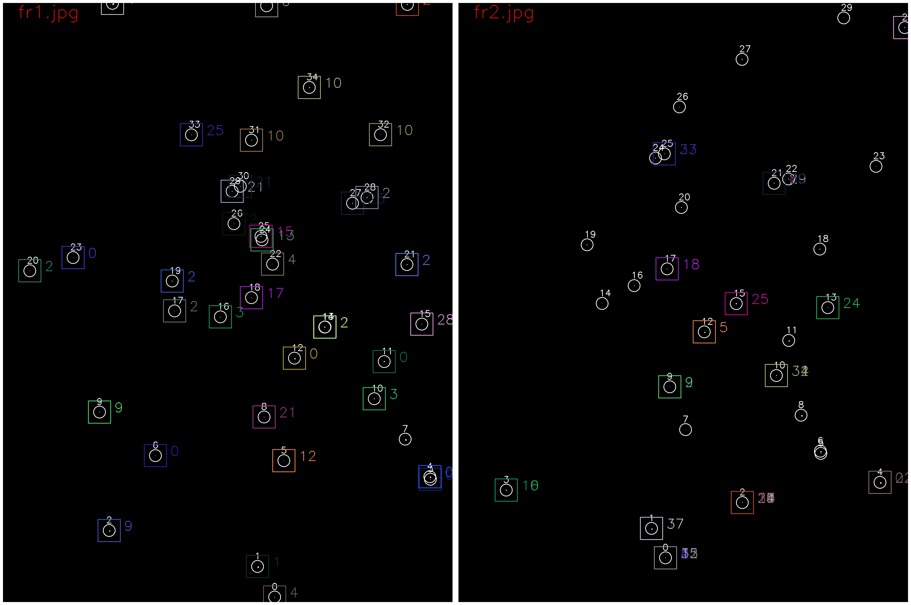

# Matala ex1_stars

## Q1
Write a simple and effective algorithm to match two pictures - one with hundreds of stars and the other with 10-20 stars. Choose the simplest existing method in this section.

Implemented a simple algorithm based on this article:
- Method: https://link.springer.com/article/10.1007/s40747-021-00619-z
- The paper proposes a new approach to star identification for spacecraft attitude determination, using spectral graph matching. The approach constructs a neighbor graph for each main star and uses rough search and graph matching to dynamically search for the most similar neighbor graph.
- Algorithm main functionality:
- For each image:
  - Load the image and convert it to grayscale.
  - Calculate the brightness threshold for the image.
  - Convert the image to black and white based on the brightness threshold.
  - Find contours in the image. Each contour is assumed to be a star.
  - For each contour, check its size, brightness, and position, and save it into a file. Filter out contours whose areas are less than or greater than the initial parameters.
  - Construct a neighbor graph for each star and build a minimum spanning tree (MST) from this graph. Node properties include star radius and brightness, and edge properties include distance.
  - If the star has less than 2 neighbours than it's being skipped. In addion, if it has more than 4 neighbours, the app pick the most bright neighbours.
  - Compare each pair of MSTs from two images using graph isomorphism.
  - Return a list of matching stars: output/results.csv

## Q2
Create a library that takes a star image and converts it to a file of coordinates x, y, r, b where x and y represent the coordinates of each star while r represents the radius and b represents the brightness.

- The library takes a list of images and creates a CSV file for each image containing the x, y, r, b parameters.

## Q3
Create a library that takes two images and calculates the best match between them by generating a list of coordinate pairs that point to the same star in each image.

- The library compare each two images and return a matching in case it detect two similar stars in both files. The results are saved into a result file.

## Settings
- There are several configuration options to be used in the app:
  - Image Brightness: Currently this is being calculated based on image intensity. However, this can be modified in case the image is too dark or too bright.
  - Star Area: This parameter set the minmum and maximum area in the umage to be identified as a star. 
  - Radius: this parameter set the star neighbours max distance in pixels.
  - Draw Graph: An option to draw the MST graph: 
  - Rotate: An option to rotate an image 180 degrees for testing purpose.

## Usage
- python3 main.py: The application will find all jpg files under the root folder and find a match.
- python3 main.py <img_name_1> <img_name_2> ... <img_name_n>: The application will use only the images provided.

## Improvements
- There are some further improvements required in order to perfect the matching process.
- I have evaluated two matching algorithms:
  - Graph Isomorphism
  - A custom implementation that matches edges and nodes
  - However, the Graph Isomorphism algorithm posed a challenge since it requires all nodes in one graph to be present in the other. This created a problem as there were neighboring nodes that were not present in both graphs. As a solution, I developed my own matching algorithm that selects the most appropriate candidate for a match.
- An additional enhancement could involve incorporating the angle formed between a star and its neighboring stars as a feature to further refine the matching process.

## Example
- Running the application on fr1.jpg and fr2.jpg. i.e.: main.py fr1.jpg fr2.jpg will produce the following:
- Output: [result.csv](examples/results.csv)
- Stars identified CSV file: [fr1.csv](examples/fr1.csv)
- Stars identified Image file: 
- Match Image: 
- More results has been uploaded as a zip file [output.zip](results/output.zip)